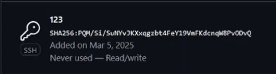
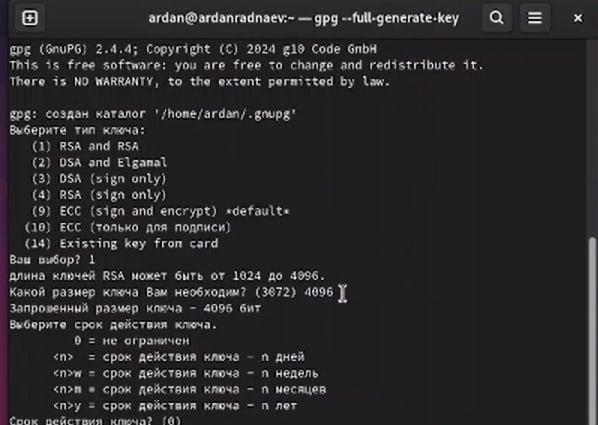
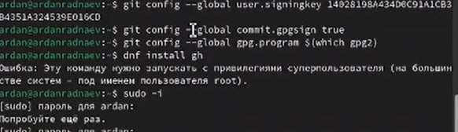
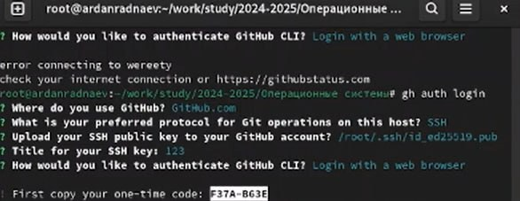

---
## Front matter
title: "Отчёт по лабораторной работе №2"
subtitle: "Специальность: архитектура компьютеров"
author: "Раднаев Ардан Баирович"

## Generic otions
lang: ru-RU
toc-title: "Содержание"

## Bibliography
bibliography: bib/cite.bib
csl: pandoc/csl/gost-r-7-0-5-2008-numeric.csl

## Pdf output format
toc: true # Table of contents
toc-depth: 2
lof: true # List of figures
lot: true # List of tables
fontsize: 12pt
linestretch: 1.5
papersize: a4
documentclass: scrreprt
## I18n polyglossia
polyglossia-lang:
  name: russian
  options:
	- spelling=modern
	- babelshorthands=true
polyglossia-otherlangs:
  name: english
## I18n babel
babel-lang: russian
babel-otherlangs: english
## Fonts
mainfont: IBM Plex Serif
romanfont: IBM Plex Serif
sansfont: IBM Plex Sans
monofont: IBM Plex Mono
mathfont: STIX Two Math
mainfontoptions: Ligatures=Common,Ligatures=TeX,Scale=0.94
romanfontoptions: Ligatures=Common,Ligatures=TeX,Scale=0.94
sansfontoptions: Ligatures=Common,Ligatures=TeX,Scale=MatchLowercase,Scale=0.94
monofontoptions: Scale=MatchLowercase,Scale=0.94,FakeStretch=0.9
mathfontoptions:
## Biblatex
biblatex: true
biblio-style: "gost-numeric"
biblatexoptions:
  - parentracker=true
  - backend=biber
  - hyperref=auto
  - language=auto
  - autolang=other*
  - citestyle=gost-numeric
## Pandoc-crossref LaTeX customization
figureTitle: "Рис."
tableTitle: "Таблица"
listingTitle: "Листинг"
lofTitle: "Список иллюстраций"
lotTitle: "Список таблиц"
lolTitle: "Листинги"
## Misc options
indent: true
header-includes:
  - \usepackage{indentfirst}
  - \usepackage{float} # keep figures where there are in the text
  - \floatplacement{figure}{H} # keep figures where there are in the text
---

# Цель работы

Целью данной работы является изучение идеологии и применения средств контроля версий и освоение умения по работе с git.

# Задание

1. Создать базовую конфигурацию для работы с git.
2. Создать ключ SSH.
3. Создать ключ PGP.
4. Настроить подписи git.
5. Зарегистрироваться на Github.
6. Создать локальный каталог для выполнения заданий по предмету.

# Теоретическое введение

Системы контроля версий (Version Control System, VCS) применяются при работе нескольких человек над одним проектом. Обычно основное дерево проекта хранится в локальном или удалённом репозитории, к которому настроен доступ для участников проекта. При внесении изменений в содержание проекта система контроля версий позволяет их фиксировать, совмещать изменения, произведённые разными участниками проекта, производить откат к любой более ранней версии проекта, если это требуется.

В классических системах контроля версий используется централизованная модель, предполагающая наличие единого репозитория для хранения файлов. Выполнение большинства функций по управлению версиями осуществляется специальным сервером. Участник проекта (пользователь) перед началом работы посредством определённых команд получает нужную ему версию файлов. После внесения изменений, пользователь размещает новую версию в хранилище. При этом предыдущие версии не удаляются из центрального хранилища и к ним можно вернуться в любой момент. Сервер может сохранять не полную версию изменённых файлов, а производить так называемую дельта-компрессию — сохранять только изменения между последовательными версиями, что позволяет уменьшить объём хранимых данных.

Системы контроля версий поддерживают возможность отслеживания и разрешения конфликтов, которые могут возникнуть при работе нескольких человек над одним файлом. Можно объединить (слить) изменения, сделанные разными участниками (автоматически или вручную), вручную выбрать нужную версию, отменить изменения вовсе или заблокировать файлы для изменения. В зависимости от настроек блокировка не позволяет другим пользователям получить рабочую копию или препятствует изменению рабочей копии файла средствами файловой системы ОС, обеспечивая таким образом, привилегированный доступ только одному пользователю, работающему с файлом.

Системы контроля версий также могут обеспечивать дополнительные, более гибкие функциональные возможности. Например, они могут поддерживать работу с несколькими версиями одного файла, сохраняя общую историю изменений до точки ветвления версий и собственные истории изменений каждой ветви. Кроме того, обычно доступна информация о том, кто из участников, когда и какие изменения вносил. Обычно такого рода информация хранится в журнале изменений, доступ к которому можно ограничить.

В отличие от классических, в распределённых системах контроля версий центральный репозиторий не является обязательным.

Среди классических VCS наиболее известны CVS, Subversion, а среди распределённых — Git, Bazaar, Mercurial. Принципы их работы схожи, отличаются они в основном синтаксисом используемых в работе команд.

# Выполнение лабораторной работы

## Установка git и gh

Установим гит командой dnf install git, установим gh командой dnf install gh

## Базовая настройка git.

Открываем терминал. При помощи команд git config --global user.name и git config --global user.email зададим имя пользователя и адрес электронной почты. При помощи команды git config --global core.quotepath false настроим utf-8 в выводе сообщений git. При помощи команды git config --global init.defaultBranch master зададим начальной ветке имя master. (рис. [-@fig:001])

{#fig:001 width=70%}

## Создание ssh ключа.

Для создания ключа используем команду ssh-keygen -t в терминале. (рис. [-@fig:002]) Зададим ключу размер 4096 бит. Сменим пароль при помощи команды ssh-keygen -p.

{#fig:002 width=70%}

### Добавление ssh-ключа в учетную запись ГитХаб.

Копируем созданный ключ и переносим его на сайт гитхаб в раздел ssh и gpg keys.

Создаем новый ключ, задаем ему название и переносим ключ в поле key, добавляем ключ на сайт. (рис. [-@fig:003])

{#fig:003 width=70%}

## Создание PGP ключа.

Генерируем ключ командой gpg --full-generate-key, настраиваем его по заданным требованиям. (рис. [-@fig:004])

{#fig:004 width=70%}

Выводим ключ в терминал командой gpg --list-secret-keys --keyid-format LONG. После этого экспортируем его командой gpg --armor --export. (рис. [-@fig:005])

{#fig:005 width=70%}

### Добавление ключа на ГитХаб.

Скопировав ключ, переносим его на ГитХаб, создаем на сайте новый ключ и вставляем скопированный ключ в необходимое поле.  (рис. [-@fig:006])

{#fig:006 width=70%}

### Настройка автоматических подписей коммитов git

При помощи команд git config --global user.signingkey, git config --global commit.gpgsign true и git config --global gpg.program $(which gpg2) самостоятельно выбираем подписи коммитов в git. (рис. [-@fig:007])

{#fig:007 width=70%}

## Настройка gh

Введя в терминал команду gh auth login, ответим на необходимые в терминале вопросы, после чего авторизуемся через браузер. (рис. [-@fig:008])

{#fig:008 width=70%}

## Создание и настройка репозитория курса.

Используя команды mkdir, gh repo, create study и git clone создаем репозиторий курса. (рис. [-@fig:009])

{#fig:009 width=70%}

Отправляем файлы первой лабораторной работы на сервер. (рис. [-@fig:010])

{#fig:010 width=70%}

# Контрольные вопросы

1. Что такое системы контроля версий (VCS) и для решения каких задач они предназначаются?

Система контроля версий — программное обеспечение для облегчения работы с изменяющейся информацией. Система управления версиями позволяет хранить несколько версий одного и того же документа, при необходимости возвращаться к более ранним версиям, определять, кто и когда сделал то или иное изменение, и многое другое. Системы контроля версий (Version Control System, VCS) применяются для:
Хранение полной истории изменений причин всех производимых изменений
Откат изменений, если что-то пошло не так
Поиск причины и ответственного за появления ошибок в программе
Совместная работа группы над одним проектом
Возможность изменять код, не мешая работе других пользователей

2. Объясните следующие понятия VCS и их отношения: хранилище, commit, история, рабочая копия

Репозиторий - хранилище версий - в нем хранятся все документы вместе с историей их изменения и другой служебной информацией.Commit — отслеживание изменений
Рабочая копия - копия проекта, связанная с репозиторием (текущее состояние файлов проекта, основанное на версии из хранилища (обычно на последней)
История хранит все изменения в проекте и позволяет при необходимости обратиться к нужным данным.

3. Что представляют собой и чем отличаются централизованные и децентрализованные VCS? Приведите примеры VCS каждого вида

Централизованные VCS (Subversion; CVS; TFS; VAULT; AccuRev):
Одно основное хранилище всего проекта
Каждый пользователь копирует себе необходимые ему файлы из этого репозитория, изменяет и, затем, добавляет свои изменения обратно Децентрализованные VCS (Git; Mercurial; Bazaar):
У каждого пользователя свой вариант (возможно не один) репозитория
Присутствует возможность добавлять и забирать изменения из любого репозитория . В классических системах контроля версий используется централизованная модель, предполагающая наличие единого репозитория для хранения файлов. Выполнение большинства функций по управлению версиями осуществляется специальным сервером. В отличие от классических, в распределённых системах контроля версий центральный репозиторий не является обязательным.

4. Опишите действия с VCS при единоличной работе с хранилищем.

Сначала создаем и подключаем удаленный репозиторий. Затем по мере изменения проекта отправлять эти изменения на сервер.

5. Опишите порядок работы с общим хранилищем VCS.

Участник проекта (пользователь) перед началом работы посредством определённых команд получает нужную ему версию файлов. После внесения изменений, пользователь размещает новую версию в хранилище. При этом предыдущие версии не удаляются из центрального хранилища и к ним можно вернуться в любой момент.

6. Каковы основные задачи, решаемые инструментальным средством git?

Первая — хранить информацию о всех изменениях в вашем коде, начиная с самой первой строчки, а вторая — обеспечение удобства командной работы над кодом.

7. Назовите и дайте краткую характеристику командам git.

Наиболее часто используемые команды git: • создание основного дерева репозитория: git init • получение обновлений (изменений) текущего дерева из центрального репозитория: git pull • отправка всех произведённых изменений локального дерева в центральный репозиторий: git push • просмотр списка изменённых файлов в текущей директории: git status • просмотр текущих изменения: git diff • сохранение текущих изменений: – добавить все изменённые и/или созданные файлы и/или каталоги: git add. – добавить конкретные изменённые и/или созданные файлы и/или каталоги: git add имена_файлов • удалить файл и/или каталог из индекса репозитория (при этом файл и/или каталог остаётся в локальной директории): git rm имена_файлов • сохранение добавленных изменений: – сохранить все добавленные изменения и все изменённые файлы: git commit -am ‘Описание коммита’ – сохранить добавленные изменения с внесением комментария через встроенный редактор git commit • создание новой ветки, базирующейся на текущей: git checkout -b имя_ветки • переключение на некоторую ветку: git checkout имя_ветки (при переключении на ветку, которой ещё нет в локальном репозитории, она будет создана и связана с удалённой) • отправка изменений конкретной ветки в центральный репозиторий: git push origin имя_ветки • слияние ветки с текущим деревом: git merge –no-ff имя_ветки • удаление ветки: – удаление локальной уже слитой с основным деревом ветки: git branch -d имя_ветки – принудительное удаление локальной ветки: git branch -D имя_ветки – удаление ветки с центрального репозитория: git push origin :имя_ветки

8. Приведите примеры использования при работе с локальным и удалённым репозиториями.

git push –all (push origin master/любой branch)

9. Что такое и зачем могут быть нужны ветви (branches)?

Ветвление («ветка», branch) — один из параллельных участков истории в одном хранилище, исходящих из одной версии (точки ветвления). [3] • Обычно есть главная ветка (master), или ствол (trunk). • Между ветками, то есть их концами, возможно слияние. Используются для разработки новых функций.

10. Как и зачем можно игнорировать некоторые файлы при commit?

Во время работы над проектом так или иначе могут создаваться файлы, которые не требуется добавлять в последствии в репозиторий. Например, временные файлы, создаваемые редакторами, или объектные файлы, создаваемые компиляторами. Можно прописать шаблоны игнорируемых при добавлении в репозиторий типов файлов в файл .gitignore с помощью сервисов.

# Выводы

В результате выполнения данной лабораторной работы я приобрел необходимые навыки работы с гит, научился созданию репозиториев, gpg и ssh ключей, настроил каталог курса и  авторизовался в gh.

# Список литературы{.unnumbered}

::: {#refs}
:::

